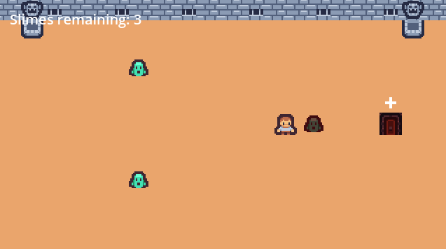
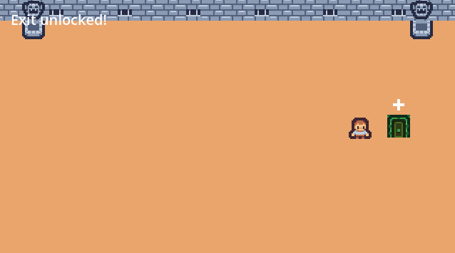
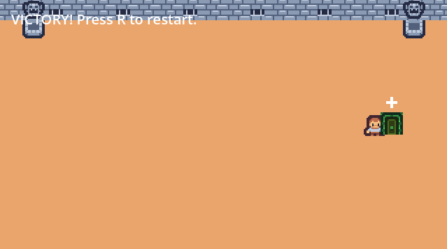

# Blade Trial

Blade Trial is a small top-down pixel action game built in Godot using GDScript. I created it as a beginner game-development project for my Tech Transition Roadmap.

## Screenshots

### Combat

### Exit Unlocked

### Victory

## Gameplay Video

[Watch the gameplay demonstration](Gameplay.mp4)

## Gameplay

The player must defeat three slimes using a directional sword attack. Defeating every slime unlocks the exit and allows the player to complete the level.

## Features

- Four-direction player movement
- Collision-based room boundaries
- Directional sword combat
- Enemy health and damage feedback
- Enemy defeat tracking
- Locked and unlocked exit states
- Victory and restart system
- Pixel-art environment
- Original exit-rune design

## Controls

- Arrow keys: Move
- Space or Enter: Attack
- R: Restart after victory

## What I Learned

- Organizing a project with Godot scenes and nodes
- Writing basic gameplay logic with GDScript
- Using CharacterBody2D for player movement
- Using Area2D for attacks, enemies, and triggers
- Connecting signals through code
- Working with collision shapes
- Tracking game state and win conditions
- Importing and displaying pixel-art assets
- Debugging indentation and missing-node errors
- Separating gameplay logic from visual assets

## Problems I Solved

### Mixed indentation

Godot reported an error because the script contained both tabs and spaces. I corrected the indentation so the script could run consistently.

### Missing SlimeSprite node

One enemy crashed when the damage script attempted to access a node that did not exist at the expected path. I compared the enemy node structures, corrected the node name, and added a safer null check.

## Tools

- Godot 4
- GDScript
- Kenney Tiny Dungeon assets
- Original Godot-created pixel rune

## Asset Credits

See [CREDITS.md](CREDITS.md) for artwork and licensing information.

## Future Improvement

The next version could add one feature such as enemy movement, player health, or animated character sprites.
